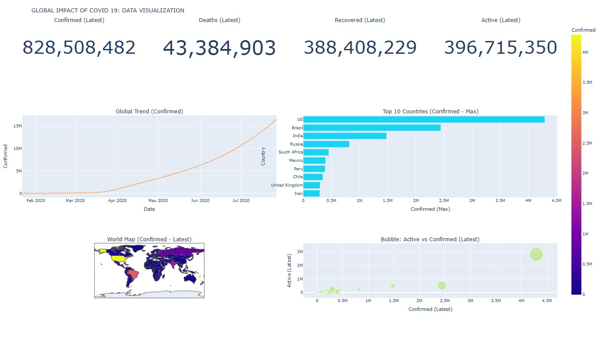

# Global Impact of COVID-19: Data Visualization

## Project Overview
This project explores the global impact of COVID-19 through data analysis and visualization using Python, Tableau, and Microsoft Excel.

Three dashboards were developed to examine confirmed cases, deaths, recoveries, active cases, geographical distribution, and trends across countries and WHO regions.

## Project Objectives
- Analyze global COVID-19 trends over time.
- Compare COVID-19 cases across countries.
- Visualize the geographical distribution of the pandemic.
- Explore recovery and mortality patterns.
- Demonstrate data visualization techniques using three different analytical tools.

## Tools and Technologies
- **Python:** Pandas, NumPy, Matplotlib, Seaborn, Plotly, Folium, Statsmodels
- **Tableau:** Interactive dashboards and geographical visualization
- **Microsoft Excel:** Charts, KPI summaries, and dashboards
- **Google Colab:** Python development environment

## Dataset
Historical global COVID-19 data covering January 22, 2020, through July 27, 2020, with 49,068 records and 10 original columns.

## Dashboard 1: Python
Includes:
- Global COVID-19 trend analysis
- Top 10 countries comparison
- World map visualization
- Active vs. confirmed cases bubble chart
- Time-series analysis and ARIMA forecasting

## Dashboard 2: Tableau
Includes:
- Global confirmed, death, recovered, and active case summaries
- Country-level geographical analysis
- WHO regional comparisons
- Top 10 countries by confirmed cases
- Interactive country and region filters

## Dashboard 3: Microsoft Excel
Includes:
- Global COVID-19 KPI cards
- Confirmed, recovered, and death trends
- Recovery rate comparison by WHO region
- Top 10 countries comparison

## Skills Demonstrated
Data Cleaning | Exploratory Data Analysis | Data Visualization | Time-Series Analysis | Dashboard Development | Python | Tableau | Excel

## Limitations
This project uses historical data and is not a real-time COVID-19 tracker. Dashboard KPI values and aggregation methods should be reviewed before using the results as official global totals.

## Dashboard Screenshots

### Python Dashboard

### Tableau Dashboard

### Excel Dashboard

## Author
Md Alamgir Shahidullah

M.S. in Data Science  
Saint Peter's University, New Jersey, USA
